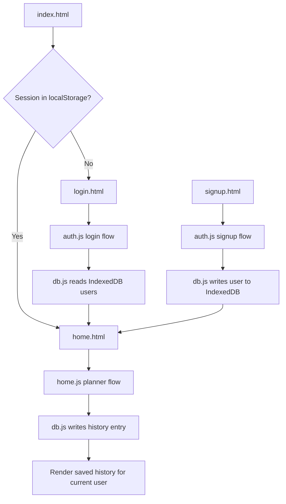

# Brew Coffee Chat

Brew Coffee Chat is a lightweight web app for meeting thoughtful strangers for one good coffee chat.

The app includes:
- a signup page for new users
- a login page for returning users
- a calm sage-green home page
- a coffee chat planner
- per-user saved chat history stored locally in the browser with IndexedDB

## Pages

- `signup.html` - create a local account
- `login.html` - sign in with an existing account
- `home.html` - main app experience and saved history
- `index.html` - redirects based on whether a session exists

## Tech

- HTML
- CSS
- Vanilla JavaScript
- IndexedDB for local data storage
- localStorage for session handling

## Architecture

The app uses a simple static front-end architecture with browser-based persistence.

### Core modules

- `index.html`
  Redirect entry point. Sends the user to `home.html` if a session exists, otherwise to `login.html`.
- `signup.html`
  Collects new user information and creates a local account.
- `login.html`
  Authenticates an existing local user.
- `home.html`
  Main application screen for planning coffee chats and viewing saved history.
- `auth.js`
  Handles signup, login, session creation, and redirect behavior.
- `db.js`
  Wraps IndexedDB access for users and history records.
- `home.js`
  Loads the logged-in user, renders the planner, saves chat previews, and displays user-specific history.
- `styles.css`
  Shared UI styling for auth screens and the main app.

### Data model

The app stores two main record types in IndexedDB:

- `users`
  Stores account information such as name, email, password, city, and intention.
- `history`
  Stores generated coffee chat previews linked to a specific user by `userId`.

The current signed-in user is tracked separately in `localStorage` under a session key.

### Request and state flow



### Authentication approach

- Signup creates a user record in IndexedDB.
- Login validates the email and password against IndexedDB.
- A successful login stores the current user session in `localStorage`.
- Logout clears the session and returns the user to the login page.

### History behavior

- Each generated coffee chat preview is saved as a history item.
- History entries are filtered by the logged-in user's `id`.
- On page load, `home.js` fetches and renders only that user's records.

## Run locally

You can open the app directly in a browser, but using a small local server is recommended.

### Option 1: Python

```bash
python -m http.server 5500
```

Then open:

```txt
http://localhost:5500
```

## Project structure

```txt
auth.js
db.js
home.html
home.js
index.html
login.html
signup.html
styles.css
```

## Notes

- User accounts are stored locally in the current browser.
- Coffee chat history is tied to the saved local user account.
- This version does not require Firebase or any external backend.
